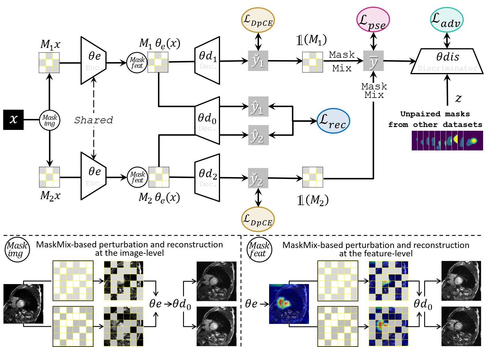
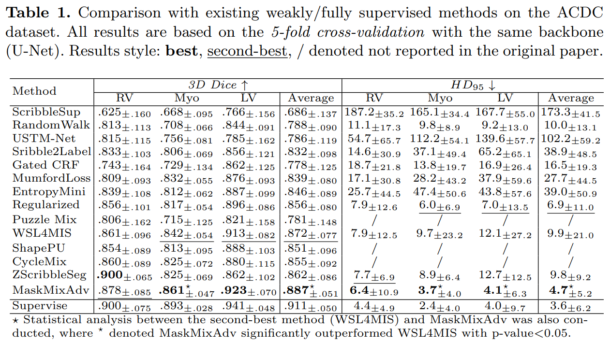
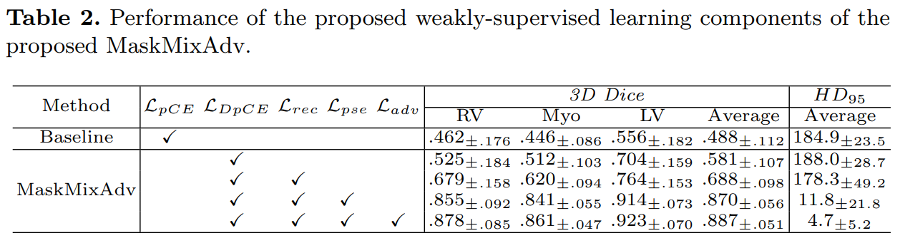
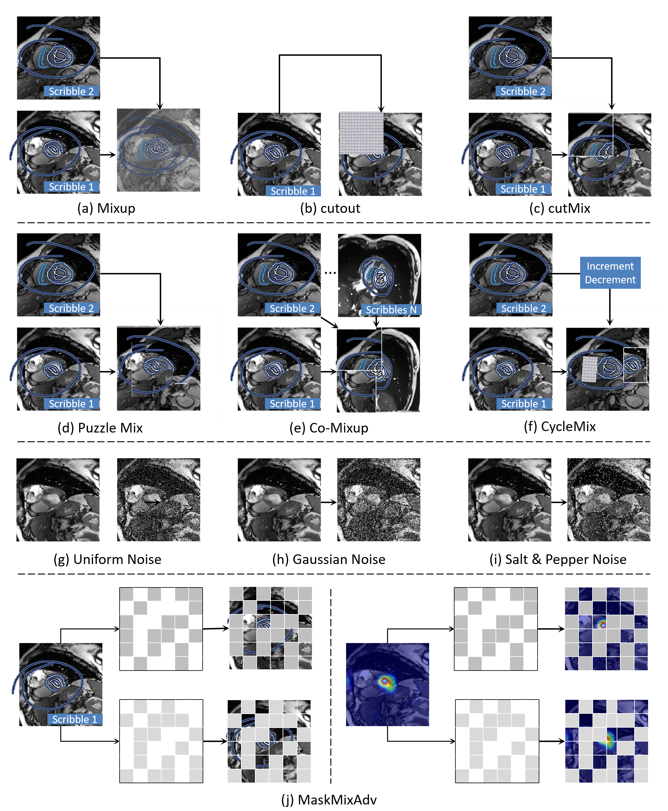

# MaskMixAdv: Scribble-supervised Medical Image Segmentation via MaskMix-based Siamese Network and Shape-aware Adversarial Learning
1) MaskMixAdv for the first time designs a Mask-based Mixup strategy (MaskMix) for scribble-supervised medical image segmentation. MaskMix introduces image-level and feature-level perturbations to one sample for data augmentation, replacing the graphical-based or the traditional cross-sample mixup approaches.

2) MaskMixAdv for the first time designs a dual-branches siamese network, trained by segmentation and reconstruction in different branches based on the MaskMix strategy. Pseudo labels are generated by integrating the two-branch prediction results through complementary binary masks, which can further boost 3D Dice.

3) MaskMixAdv learns to regularize the generated pseudo labels via shape-aware adversarial learning to incorporate additional shape priors, which can reduce the Hausdorff distance.

<p align="center"></p>

## Packages Requirements
- Hardware: PC with NVIDIA 1080T GPU. (others are alternative.)
- Software: *Ubuntu 18.04*, *CUDA 10.0.130*, *pytorch 1.3.0*, *Python 3.6.9* (others are alternative.)
- Some important required packages include:
  - `torchvision`
  - `tensorboardX`
  - `scikit-learn`
  - `glob`
  - `matplotlib`
  - `skimage`
  - `medpy`
  - `tqdm`
  - `nibabel`
  - `Efficientnet-Pytorch`: `pip install efficientnet_pytorch`
  - Other basic python packages such as `Numpy`, `Scikit-image`, `SimpleITK`, `Scipy`, `cv2` ......

# Dataset
Datasets and more details can be found from the following links. 
* The ACDC dataset with mask annotations can be downloaded from: [ACDC](https://www.creatis.insa-lyon.fr/Challenge/acdc/databases.html).
* The Scribble annotations of ACDC can be downloaded from: [Scribble](https://gvalvano.github.io/wss-multiscale-adversarial-attention-gates/data).
* The data processing code in [Here](../code/dataloaders/acdc_data_processing.py), the pre-processed ACDC data in [Here](https://github.com/HiLab-git/WSL4MIS/tree/main/data/ACDC).
* The MSCMR dataset with mask annotations can be downloaded from [MSCMRseg](https://zmiclab.github.io/zxh/0/mscmrseg19/data.html).
* Please organize the dataset as the following structure:
```
ACDC/
  -- ACDC_training_slices/
      --patient001_frame01_slice_0.h5
      ...
  -- ACDC_training_volumes/
      --patient001_frame01.h5
      ...
MSCMR_dataset/
  -- train/
      --images/
      --labels/
        --patient001_frame01.h5
  ...
```

# Usage

1. Clone this project.
```
git clone ***************
cd MaskMixAdv/code
```
2. Data pre-processing os used or the processed data.
```
python dataloaders/acdc_data_processing.py
```
3. Train the model
```
./train_wss.sh
```

4. Test the model
```
python test_2D_fully.py --sup_type scribble (or label) --exp ACDC/the_trained_model_path --model unet_model
```

# Implemented methods
* Some of the results shown are referenced from those reported in the [CVPR 2022 & Supplementary](https://openaccess.thecvf.com/content/CVPR2022/html/Zhang_CycleMix_A_Holistic_Strategy_for_Medical_Image_Segmentation_From_Scribble_CVPR_2022_paper.html) and [Weakly-supervised benchmark](https://link.springer.com/chapter/10.1007/978-3-031-16431-6_50).
* [**pCE**](https://openaccess.thecvf.com/content_cvpr_2018/papers/Tang_Normalized_Cut_Loss_CVPR_2018_paper.pdf) : [train_weakly_supervised_pCE_2D.py](./code/train_weakly_supervised_pCE_2D.py)
* [**pCE + TV**](https://arxiv.org/pdf/1605.01368.pdf) : [train_weakly_supervised_pCE_TV_2D.py](./code/train_weakly_supervised_pCE_TV_2D.py)
* [**pCE + Entropy Minimization**](https://arxiv.org/pdf/2111.02403.pdf) : [train_weakly_supervised_pCE_Entropy_Mini_2D.py](./code/train_weakly_supervised_pCE_Entropy_Mini_2D.py)
* [**pCE + GatedCRFLoss**](https://github.com/LEONOB2014/GatedCRFLoss) : [train_weakly_supervised_pCE_GatedCRFLoss_2D.py](./code/train_weakly_supervised_pCE_GatedCRFLoss_2D.py)
* [**pCE + Intensity Variance Minimization**](https://arxiv.org/pdf/2111.02403.pdf) : [train_weakly_supervised_pCE_GatedCRFLoss_2D.py](./code/train_weakly_supervised_pCE_GatedCRFLoss_2D.py)
* [**pCE + Random Walker**](http://vision.cse.psu.edu/people/chenpingY/paper/grady2006random.pdf) : [train_weakly_supervised_pCE_random_walker_2D.py](./code/train_weakly_supervised_pCE_random_walker_2D.py)
* [**pCE + MumfordShah_Loss**](https://arxiv.org/pdf/1904.02872.pdf) : [train_weakly_supervised_pCE_MumfordShah_Loss_2D.py](./code/train_weakly_supervised_pCE_MumfordShah_Loss_2D.py)
* [**Scribble2Label**](https://arxiv.org/pdf/2006.12890.pdf)
* [**USTM**](https://www.sciencedirect.com/science/article/pii/S0031320321005215) : [train_weakly_supervised_ustm_2D.py](./code/train_weakly_supervised_ustm_2D.py)
* [**WSL4MIS**](https://github.com/Luoxd1996/WSL4MIS) : [train_weakly_supervised_pCE_WSL4MIS.py](./code/train_weakly_supervised_pCE_WSL4MIS.py)

## Major results from our work
1. **The proposed MaskMixAdv achieved the best performance among all weakly-supervised learning SOTA methods on the MRI cardiac segmentation task. Results demonstrated the performance superiority of our work. Therefore, MaskMixAdv provided a more promising preferred alternative for scribble-supervised medical image segmentation, especially those without dense annotations.**

<p align="center"></p>


2. **Visualization of the results illustrated that the discrepancy between MaskMixAdv trained on scribbles and the supervised method trained on dense annotations was minor. Besides, compared with previous methods that generated misshapen predictions, MaskMixAdv generated more realistic and reasonable segmentation masks, demonstrating the effectiveness of shape-aware adversarial learning that incorporated the boundary priors and encouraged the network to localize objects in the image.**

<p align="center"></p>

3. **Ablation study indicated that: 1) Scribble-supervised methods performed poorly when only \mathcal L_{pCE} and \mathcal L_{DpCE} were applied. In contrast, performance improved after introducing \mathcal L_{rec}, demonstrating the effectiveness of the reconstruction method in helping the dual-branch siamese network to extract features from sparse supervision. 2) However, the performance of \mathcal L_{DpCE}+ \mathcal L_{rec} was still not satisfied. The pseudo labeling component (\mathcal L_{pse}) improved it, demonstrating the effectiveness of the MaskMix strategy in enhancing scribble-supervised learning (Issue \sharp1). 3) We observed that the HD_{95} of \mathcal L_{DpCE}+\mathcal L_{rec}+\mathcal L_{pse} was still far below that of supervised methods, which meant that some target structures were lost and the boundaries were imprecise. However, adversarial learning (\mathcal L_{adv}) optimized this drawback (Issue \sharp2), reducing the HD_{95} discrepancy between the weakly and fully supervised methods.**

<p align="center"></p>

4. **.**

<p align="center"></p>

5. **.**

<p align="center"></p>


6. **.**

<p align="center"></p>

## Acknowledgement
Anonymous
## Reference
Anonymous
## License
Anonymous

#### ** We hope that in the light of our study, the medical imaging and computer vision community will benefit from the use of more powerful weakly-supervised models. **
