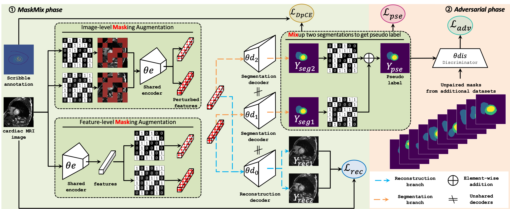

# MaskMixAdv: Scribble-supervised Medical Image Segmentation via MaskMix-based Siamese Network and Shape-aware Adversarial Learning

## Contributions
1) This study has successfully explored an annotation-efficient approach to dataset preparation for medical image segmentation, taking cardiac MRI segmentation as a case study. It achieves performance levels comparable to methods that necessitate time-consuming pixel-by-pixel labelling.

2) The study introduces a shape-aware adversarial learning framework for generating segmentation predictions that accurately represent real shapes. This framework offers an effective approach to refine pseudo labels by transferring shape priors from additional datasets with matching regions of interest (ROI);

3) The study introduces a new masking approach that enables single-sample data augmentation, catering to the requirement of enriching coarse-grained scribble annotations. This approach can serve as a viable alternative to other Mixup-based cross-sample data augmentation methods.

<p align="center"></p>

## Packages Requirements
- Hardware: PC with NVIDIA 1080T GPU. (others are alternative.)
- Software: *Ubuntu 18.04*, *CUDA 10.0.130*, *pytorch 1.3.0*, *Python 3.6.9* (others are alternative.)
- Some important required packages include:
  - `torchvision`
  - `tensorboardX`
  - `scikit-learn`
  - `glob`
  - `matplotlib`
  - `skimage`
  - `medpy`
  - `tqdm`
  - `nibabel`
  - `Efficientnet-Pytorch`: `pip install efficientnet_pytorch`
  - Other basic python packages such as `Numpy`, `Scikit-image`, `SimpleITK`, `Scipy`, `cv2` ......

# Dataset
The case study conducted an assessment of the MaskMixAdv framework in the context of Cardiac MRI segmentation, which served as an ideal scenario to assess the capabilities and practicality of the MaskMixAdv framework. This case study focused on the specific task of delineating the left ventricular cavity, myocardium, and right ventricle from MRI images.

Datasets and more details can be found from the following links. 
* The ACDC dataset with paired mask annotations can be downloaded from: [ACDC](https://www.creatis.insa-lyon.fr/Challenge/acdc/databases.html).
* The scribble annotations of ACDC can be downloaded from: [Scribble](https://gvalvano.github.io/wss-multiscale-adversarial-attention-gates/data).

* The MSCMR dataset with paired mask annotations can be downloaded from [MSCMRseg](https://zmiclab.github.io/zxh/0/mscmrseg19/data.html).
* The scribble annotations of MSCMR can be downloaded from: [Scribble](https://github.com/BWGZK/CycleMix/tree/main/MSCMR_scribbles).
* 
* Please organize the dataset as the following structure:
```
ACDC/
  -- ACDC_training_slices/
      --patient001_frame01_slice_0.h5
      ...
  -- ACDC_training_volumes/
      --patient001_frame01.h5
      ...
MSCMR_dataset/
  -- train/
      --images/
      --labels/
        --patient001_frame01.h5
  ...
```
* The data processing code is released in [Here](../code/dataloaders/acdc_data_processing.py), the pre-processed ACDC dataset is released in [Here](https://github.com/HiLab-git/WSL4MIS/tree/main/data/ACDC).

# Usage

1. Clone this project.
```
git clone ***************
cd MaskMixAdv/code
```
2. Data pre-processing os used or the processed data.
```
python dataloaders/acdc_data_processing.py
```
3. Train the model
```
./train_wss.sh
```

4. Test the model
```
python test_2D_fully.py --sup_type <scribble or label> --exp ACDC/<the_trained_model_path> --model <model_name>
```

# Implemented methods
* Some of the results shown are referenced from those reported in the [CVPR 2022 & Supplementary](https://openaccess.thecvf.com/content/CVPR2022/html/Zhang_CycleMix_A_Holistic_Strategy_for_Medical_Image_Segmentation_From_Scribble_CVPR_2022_paper.html) and [Weakly-supervised benchmark](https://link.springer.com/chapter/10.807/978-3-031-16431-6_50).
* [**pCE**](https://openaccess.thecvf.com/content_cvpr_2018/papers/Tang_Normalized_Cut_Loss_CVPR_2018_paper.pdf) : [train_weakly_supervised_pCE_2D.py](./code/train_weakly_supervised_pCE_2D.py)
* [**pCE + TV**](https://arxiv.org/pdf/1605.01368.pdf) : [train_weakly_supervised_pCE_TV_2D.py](./code/train_weakly_supervised_pCE_TV_2D.py)
* [**pCE + Entropy Minimization**](https://arxiv.org/pdf/2111.02403.pdf) : [train_weakly_supervised_pCE_Entropy_Mini_2D.py](./code/train_weakly_supervised_pCE_Entropy_Mini_2D.py)
* [**pCE + GatedCRFLoss**](https://github.com/LEONOB2014/GatedCRFLoss) : [train_weakly_supervised_pCE_GatedCRFLoss_2D.py](./code/train_weakly_supervised_pCE_GatedCRFLoss_2D.py)
* [**pCE + Random Walker**](http://vision.cse.psu.edu/people/chenpingY/paper/grady2006random.pdf) : [train_weakly_supervised_pCE_random_walker_2D.py](./code/train_weakly_supervised_pCE_random_walker_2D.py)
* [**pCE + MumfordShah_Loss**](https://arxiv.org/pdf/1804.02872.pdf) : [train_weakly_supervised_pCE_MumfordShah_Loss_2D.py](./code/train_weakly_supervised_pCE_MumfordShah_Loss_2D.py)
* [**Scribble2Label**](https://arxiv.org/pdf/2006.12880.pdf)
* [**USTM**](https://www.sciencedirect.com/science/article/pii/S003132032805215) : [train_weakly_supervised_ustm_2D.py](./code/train_weakly_supervised_ustm_2D.py)
* [**WSL4MIS**](https://github.com/Luoxd1996/WSL4MIS) : [train_weakly_supervised_pCE_WSL4MIS.py](./code/train_weakly_supervised_pCE_WSL4MIS.py)
* [**MaskMixAdv**](ours) : [train_weakly_supervised_pCE_MaskMixAdv.py](./code/train_weakly_supervised_pCE_MaskMixAdv.py)

## Major results from our work
1. **MaskMixAdv achieved the best performance among all weakly-supervised learning SOTA methods on the MRI cardiac segmentation.**

2. **The discrepancy between MaskMixAdv trained on scribbles and the supervised method trained on dense annotations was minor. Compared with previous methods that generated misshapen predictions, MaskMixAdv generated more realistic and reasonable segmentation masks.**

3. **MaskMixAdv achieved the best performance among all image-level and feature-level perturbations on the MRI cardiac segmentation.**

4. **Visual demonstration of the results of the proposed MaskMixAdv and other methods for cardiac MR data perturbation. Only perturbations at the image level are shown here, and perturbations at the feature level are similar and thus omitted. For the Mixup-based approach, we introduce white outlines to easily distinguish the multi-sample mixing process. Note the scribbles shown here are bolded for ease of viewing.**

5. **MaskMixAdv was extended to point-supervised cardiac segmentation on the ACDC dataset. The minor performance gap demonstrated the scalability of our work. We will release the code for generating point annotations before publication in this repo.**

## Acknowledgement
Anonymous
## Reference
Anonymous
## License
Anonymous

#### ** We hope that in the light of our study, the medical imaging community will benefit from the use of more powerful weakly-supervised methods. **
